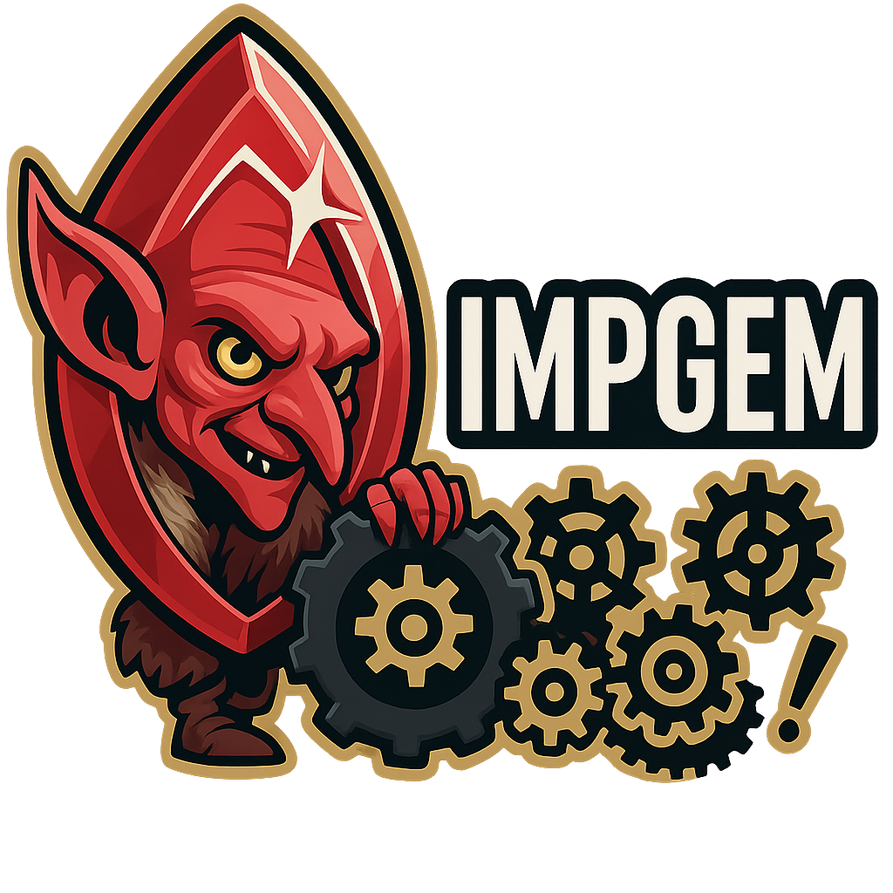

<h1 align="center">
  <br>
  <div style="width:20px; height:80px; border-radius:50%; overflow:hidden; border:4px solid #333; margin: 0 auto; display:flex; align-items:center; justify-content:center;">
    
  </div>
  The Imp Gem: A Self-Hosted CI/CD Forge of Clockwork Automation
  <br>
</h1>

<h4 align="center">
A bare-bones, containerized task automation system built with Python and <a href="https://www.docker.com/" target="_blank">Docker</a>, inspired by <a href="https://buildbot.net/" target="_blank">Buildbot</a> and ideas from <a href="https://github.com/actions/runner" target="_blank">GitHub Actions</a> containerized self-hosted runners.
</h4>
<div align="center">
<em>
   The <a href="https://divinityoriginalsin2.wiki.fextralife.com/Running+like+Clockwork" target="_blank">Imp Gem</a> is a mysterious artifact from Larian Studios' Divinity: Original Sin 2, containing an entire self-contained mechanical world—the Pocket Plane of Xantezza—completely isolated from the outside. Inside this gemstone, imp engineers run wild, endlessly tinkering, experimenting, and building strange contraptions in their infinite pocket universe of gears, springs, and slightly irresponsible inventions. Think: endless automation, bizarre machinery, and plenty of explosions… all entirely intentional.
</em>
</div>
<br>
<p align="center">
  <a href="#"></a>
  <a href="#"></a>
  <a href="#"></a>
  <a href="#"></a>
</p>

<p align="center">
  <a href="#key-features">Key Features</a> •
  <a href="#related">Requirements</a> •
  <a href="#how-to-use">How To Use</a> •
  <a href="#related">Services</a> •
  <a href="#related">Related</a> •
  <a href="#license">License</a>
</p>

## Key Features

  * ▶️ Robust system to run Bash commands or scripts in isolated environments, delivering generated artifacts on demand
  * ⚙️ Containerized automation stack built with FastAPI, TaskIQ, and Redis, inspired by Buildbot and GitHub Actions runners
  * 🔥 Lightweight, self-hosted task runner for containerized, reproducible job execution
  * 🔄 Background task scheduling powered by TaskIQ with Redis as the message broker
  * 🔌 FastAPI-based API server for external orchestration, status reporting, and integration
  * 🔒 Isolated frontend and backend Docker networks for enhanced security and service separation
  * 🚀 Managed with docker-compose and streamlined with an optional Makefile workflow
  * 📦 Supports both local and containerized development setups with minimal friction
  * 🐳 Privileged Docker-in-Docker container (DinD) enabling nested container orchestration inside jobs#

## Requirements

Before you begin, ensure that you have the following tools installed:

- **Docker** (v20.10 or higher)
- **Docker Compose** (v1.27 or higher)
- **(Optional for devcontainers) GoLang Docker Credential Helper** (v0.6.4 or higher)

Ensure that your system has access to the necessary network and storage configurations.

## How to Use

Follow the steps below to get the project running in your local environment.

### Set Up Environment Variables

Ensure you have a `.env` file in the root of your project directory (the default `.env` is available [here](./.env). This file should contain any necessary environment variables required by the services.

### Building and Running 

##### Makefile

A `Makefile` was created to simplify the setup and execution of the project. Here's how you can use it:

1. **Set Up Environment**:
   To set up the environment, install dependencies, and choose how to run the app, execute:

   ```bash
   make build
   ```

   This will:

   - Check if Miniconda and Docker are installed.
   - Prompts the user to confirm the installation of Miniconda and Docker if not found.
   - Set up a Conda environment (`buildbot`) with Python 3.11 if it doesn’t exist yet.
   - Install dependencies using Poetry.
   - Prompts the user to choose whether to run the app via Docker Compose or manually.
   - If running manually, it starts Redis, the TaskIQ scheduler, and the Buildbot API.

2. **Run**:

   - If you want to run the app using Docker Compose, simply run:

   ```bash
   make run_docker
   ```

   - To run the app locally using FastAPI and Debugpy, run:

   ```bash
   make run_local
   ```

   - To build and choose how to run the app, run:

   ```bash
   make run
   ```

   - To stop the app, run:

   ```bash
   make stop_local
   ```

   - To stop the app using Docker Compose, run:

   ```bash
   make stop_docker
   ```

#### Docker Compose

With Docker Compose, you can build and run the services as follows:

```bash
docker-compose up --build
```

This will build the images defined in the `Dockerfile`, start all the containers, and set up the services as per the `docker-compose.yml` file. The `--build` flag ensures that the containers are built before starting.

##### Stopping the Services

When you want to stop the services, simply run:

```bash
docker-compose down
```

This will stop and remove the containers. To remove containers and volumes, you can use:

```bash
docker-compose down -v
```

##### TaskIQ Dependency

Note that taskIQ must be running for the app to function properly. The scheduler service is started automatically in the background via a vscode pre-launch task (run-scheduler). To start the scheduler manually, run:

```bash
conda run -v --live-stream -n buildbot env PYTHONPATH=buildbot taskiq scheduler app.background.broker:scheduler
```

## Services

The project includes four main services:

1. **API** - Exposes the Buildbot API and manages interactions.
2. **Job Manager** - Handles background tasks and job scheduling.
3. **Redis** - Acts as a message broker between the components.
4. **Docker (DinD)** - Provides Docker-in-Docker functionality for tasks requiring Docker commands.

### Service Breakdown:

- **api**: Exposes a REST API to interact with Buildbot. It connects to both the frontend and backend networks, maps port 8000, and uses environment variables and certificates.
- **job-manager**: Manages background tasks and schedules jobs. It connects to the backend network and relies on Redis for communication.
- **redis**: Redis instance that acts as a broker between services.
- **docker**: Provides Docker-in-Docker (DinD) for containerized Docker tasks. It requires privileged access.


## Related

* [GitHub Actions](https://github.com/actions/runner) - Self-hosted runners and workflow automation
* [Buildbot](https://buildbot.net/) - The CI automation framework

## License

MIT

---

> GitHub [@brunohaf](https://github.com/brunohaf)
